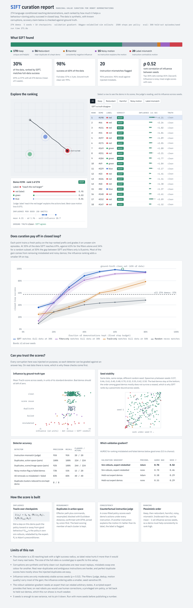

# SIFT

**Marginal-value curation for robot demonstration data.**

Demonstration datasets are collected, not curated. Many trajectories are near-duplicates, some carry the wrong language instruction, and a few dominate what the policy actually learns. SIFT ranks every trajectory by how much it helps a behaviour-cloning policy succeed in closed loop, flags the ones that hurt, and tests the ranking by retraining on curated subsets.

Think of a textbook where half the exercises drill the same thing and a few have the wrong answer in the key. Writing more exercises is not the useful work. The useful work is finding the fifth of them that carries the learning and pulling the ones that teach the wrong answer.

```bash
pip install -e .            # only dependency: numpy
python -m sift demo         # ~2.5 min on 4 cores; writes report/index.html
python -m sift demo --quick # ~40 s first look
```

`demo` writes `report/index.html` (interactive report), `report/ranking.csv` (one row per demo, best first), `report/results.json` (everything the page shows) and `report/demos.npz` (the generated dataset).

| Command | What it does |
|---|---|
| `sift demo` | Generate a corrupted synthetic dataset, curate it, write the report |
| `sift curate --data demos.npz` | Same pipeline on your own `.npz` (ground truth optional) |
| `sift export --data demos.npz --results report/results.json --frac 0.3` | Write the top 30% of the ranking as a new dataset |
| `sift export ... --verdicts keep,redundant` | Or keep demos by verdict instead of by budget |
| `sift report --results report/results.json` | Re-render the page from saved results without recomputing |
| `sift generate --out demos.npz` | Just write a synthetic dataset |

Useful flags: `--seeds N`, `--steps`, `--n-checkpoints`, `--n-eval`, `--val-mode heldout`, `--no-precondition`, `--project-dim K`, `--no-ablation`, `--quick`.

Open `report/index.html` for the interactive report. A pre-built copy from a 5-seed run is in [`docs/demo/index.html`](docs/demo/index.html).

<p align="center"><a href="docs/demo/report.png"></a></p>

## What the demo shows

The demo generates 274 demonstrations of a language-conditioned reaching task ("reach the red/green/blue target") with known corruptions injected: 56 near-duplicate replays across 8 clusters, 20 mislabelled instructions, 20 failed or hesitant demos, and 20 demos that reuse another demo's scene for a different task. Because the corruptions are known, every detector is graded against ground truth.

Results from the 5-seed run in `docs/demo` (fixed 2,500 gradient steps per policy, 300 held-out sim episodes per seed):

| Training data | Fraction | Closed-loop success (mean ± sd) |
|---|---|---|
| All demos | 100% | 0.57 ± 0.03 |
| Random subset | 50% | 0.43 ± 0.08 |
| TracIn ranking only | 50% | 0.60 ± 0.02 |
| Filters only (dedup + judge, random order) | 50% | 0.87 ± 0.02 |
| **SIFT** | **30%** | **0.69 ± 0.06** |
| **SIFT** | **50%** | **0.95 ± 0.03** |
| Ground-truth clean set (oracle) | 65% | 0.99 ± 0.01 |

| Detector | Precision | Recall |
|---|---|---|
| Instruction mismatch (counterfactual judge) | 0.95 | 0.95 |
| Duplicates, action space (pairwise) | 1.00 | 1.00 |
| Duplicates, scene/image space (pairwise) | 0.92 | 1.00 |
| Noisy-motion flag vs failed demos | 0.73 | 0.55 |

### How to read these numbers

- **SIFT beats the full dataset, not just matches it.** That is the stronger "better policy" outcome, but the size of the gap belongs to this toy: a 2D task with a tight success radius, where about 15% label noise roughly halves success. Expect a much smaller gap on real tasks.
- **The filters carry most of the gain.** Dedup plus the instruction judge, ordered randomly, gets 0.87 at 50%. The influence ordering adds about 8 points at 40–50% and only about 4 at 30%, which is within one seed sd. Influence alone (no filters) matches the full dataset only at 50%.
- **Influence is noisy.** The Spearman rank correlation between seeds is about 0.5, and the top-30% sets overlap only about 40%. Bad demos stay reliably at the bottom; the order among good demos mostly does not survive a reseed. SIFT therefore ranks by `mean − 1 sd` across seeds and never trusts a single run.
- **The validation gradient matters more than preconditioning.** With a gradient from expert-relabelled sim rollouts, AUROC for separating bad demos is 0.74. With a gradient from held-out expert demos it is 0.58. Adam preconditioning adds about 0.03 to 0.04.
- **The perfect duplicate scores mostly show that the injected duplicates are easy:** they are near-exact replays. Real near-duplicates are fuzzier.

## Mechanism

### 1. Influence: TracIn over checkpoints

Retraining once per trajectory to measure its leave-one-out effect is impossible at scale. TracIn approximates it by replaying training and asking, at each saved checkpoint, whether a gradient step on trajectory `z_i` would have lowered the validation loss:

```
influence(z_i) ≈ Σ_t η_t · ⟨∇L(z_i; θ_t), P_t ∇L(D_val; θ_t)⟩
```

- `L(z_i)` is the mean BC loss over the trajectory's steps. The trajectory, not the frame, is the unit a curator keeps or drops.
- `P_t` is Adam's diagonal preconditioner `1/√v_t`. Adam steps along `P_t g`, not `g`, so this is the closer first-order estimate. Pass `--no-precondition` for vanilla TracIn.
- `D_val` is where the compute cost sits. The default, `--val-mode rollout`, rolls each checkpoint's policy out in the sim, relabels every visited state with the expert action, and takes the BC gradient there. This is one DAgger step, and it measures what the policy should have done in the states it actually reaches, which is what closed-loop success depends on. `--val-mode heldout` uses a small trusted demo set instead. It is cheaper and needs no sim, but on this task it is much weaker (see the ablation above).

Analogy: each checkpoint is a moment in a student's study session. TracIn asks whether practising this exercise right then would have improved the score on the exam. It sums that over the session.

### 2. Near-duplicates in action space, not image space

Two demos filmed on the same table layout look identical to a vision encoder even when the robot reaches for a different object. That pair is the contrast that teaches language grounding, and image-space dedup deletes it: the scene-space baseline merges exactly those 20 "scene reuse" demos into false clusters. SIFT embeds the effector path together with the commands, resampled over normalised time. It blocks candidate pairs with one Euclidean distance matrix, confirms them with DTW so pace differences are tolerated, and joins pairs with union-find. In each cluster it keeps the member with the best influence lower bound.

### 3. Instruction–trajectory consistency

The default judge needs no API and no privileged state. It is a **cross-fitted counterfactual likelihood**: train a policy on K−1 folds, and for each held-out demo score its actions under every instruction by swapping the language conditioning. If another instruction explains the motion 3× better than the label does, the label is flagged. The ratio, rather than a loss difference, keeps sloppy-but-correct demos from being flagged, because their loss is high under every instruction. Cross-fitting matters because a policy that trained on a mislabelled demo has partly memorised the wrong label and will vouch for it.

Its by-product, the best-case loss across all instructions, flags demos that no instruction explains: failed or hesitant motion.

`ClaudeVLMJudge` is the open-vocabulary alternative. It renders the trajectory, or on a real robot you would pass camera frames, and asks Claude for a structured verdict. Install it with `pip install -e '.[vlm]'`. Each demo costs one API call; this run did not use it.

### 4. Ranking and the scaling curve

Each demo receives one verdict, `mismatch > noisy > harmful > redundant > keep`, and the ranking lists the tiers in the order keep, redundant, harmful, noisy, mismatch. Inside each tier, demos are sorted by `mean − 1 sd` influence. A prefix of this order is the curated set at any budget. Every subset trains for the same number of gradient steps, so data quality is not confounded with compute. Evaluation episodes come from a seed range disjoint from the validation rollouts used for influence.

## Using it on your own data

The package is organised so the toy pieces can be swapped out:

| Toy piece | What to replace it with |
|---|---|
| `sift.env.ReachEnv` | Your sim eval loop (needed for the rollout validation gradient and the scaling curve) |
| `sift.model.MLPPolicy` | Your policy, exposing `loss_grad(X, Y, theta) -> (loss, flat_grad)` and `predict`. For large models, project gradients to a few thousand dimensions with a random matrix before taking dot products. |
| `influence.expert_relabel` | Whatever can label arbitrary states: a privileged sim policy or human corrections. Without one, use `--val-mode heldout`. |
| `CounterfactualJudge` | Works whenever instructions come from a finite set. For free-form language, use `ClaudeVLMJudge` with real frames. |

Getting your demos in:

```python
from sift import Dataset
ds = Dataset.from_arrays(obs_list, action_list, instruction_index_list)  # lengths may differ
ds.save("mine.npz")   # then: sift curate --data mine.npz
```

A `.npz` file needs only `obs`, `actions` and `instr`. The effector path and scene layout are read back from the observation layout, and demos may have different lengths. Ground-truth fields (`tag`, `executed`, `true_cluster`) are optional. Without them, the report hides detector accuracy and the oracle reference and labels flags as candidates for review, because nothing can be graded.

Each results file stores a content fingerprint of its dataset. `sift export` refuses to apply a ranking to a different dataset, even one with the same number of demos.

**Large policies.** `--project-dim K` replaces each gradient with a K-dimensional Gaussian sketch before the dot products. The sketch is unbiased, with relative error about 1/√K. On the 5,058-parameter demo policy, the rank correlation with exact influence is 0.76 at K=64, 0.92 at K=256 and 0.98 at K=1024. Even K=256 adds far less noise than changing the training seed (ρ ≈ 0.5), so a few hundred dimensions are enough for ranking.

## Known weaknesses

- **Influence estimates in BC are noisy.** Results here are reported across 5 seeds with the variance shown. Ranks among good demos do not survive a reseed.
- **Compute is real.** Influence costs (seeds) × (checkpoints) × (one gradient per trajectory + one sim rollout batch). The scaling curve trains about 140 policies. That is cheap here and expensive for a VLA.
- **The rollout validation gradient needs an oracle that can relabel any state.** Real robots rarely have one.
- **The gain story is mostly "remove the bad data"**, which simpler filters already do. Influence earns its cost only when its lift over filters-only holds up across seeds on your task.

## Repository layout

```
sift/env.py          2D language-conditioned reaching sim (closed-loop evaluator)
sift/data.py         Trajectory/Dataset, synthetic corruptions with ground truth
sift/model.py        NumPy MLP policy with explicit gradients, Adam, checkpoints
sift/influence.py    TracIn, validation gradients, seed-stability stats
sift/duplicates.py   Action-space embedding, DTW, union-find clustering, scene baseline
sift/judge.py        Counterfactual judge, Claude VLM judge, PNG renderer
sift/curate.py       Verdicts and ranking, plus the filters-only and TracIn-only ablations
sift/scaling.py      Fixed-compute scaling curves
sift/evaluate.py     Precision/recall/AUROC against ground truth
sift/pipeline.py     End-to-end run producing results.json (validated config, NaN-free output)
sift/export.py       Ranking -> curated dataset, with fingerprint check
sift/cli.py          demo / curate / export / report / generate
sift/report*.{py,html}  Self-contained interactive report
tests/test_sift.py         core behaviour: gradients, detectors, judge, report
tests/test_edge_cases.py   malformed input, ragged/legacy/untagged files, single seed,
                           degenerate statistics, bad judge responses, CLI errors
.github/workflows/tests.yml  pytest on Python 3.10/3.12/3.13 plus a CLI smoke run
```

Run the tests with `pip install -e '.[dev]' && pytest` (78 tests, about 25 s).

### Edge-case behaviour

| Situation | Behaviour |
|---|---|
| Demos of different lengths | Supported end to end, including save/load |
| More checkpoints requested than training steps | One checkpoint per step, the last one always the final step (previously none, which made every influence score 0) |
| Most of the dataset is exact copies | Still clustered: the dedup threshold has a floor (previously it collapsed to 0 and found nothing) |
| Constant or tied influence scores | Average ranks for ties; Spearman is reported as undefined, not ≈1 |
| Most motion-loss values identical | The outlier rule falls back from MAD to mean absolute deviation and flags nothing if every value is equal |
| One seed | Runs; variance-based views are hidden and the report says the ranking is untested for stability |
| Claude judge refuses, truncates or returns off-schema JSON | Counted as no evidence for that demo; API errors still stop the run |
| Claude judge unsure | Only a disagreement with confidence ≥ 0.5 is flagged |
| Fewer demos than judge folds, empty selections, fractions outside (0, 1] | Clear `ValueError` (exit code 2 from the CLI) |
